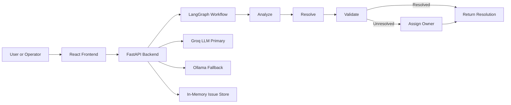

# Incident Autopilot

Production-oriented incident resolution platform that uses agentic AI to analyze incoming issues, generate remediation guidance, validate likely resolution outcomes, and route unresolved incidents to an owner.

The repository contains:
- a FastAPI backend for workflow execution and API access
- a React frontend for ticket submission and result inspection
- Docker Compose for local and production-style deployment
- Groq as the primary LLM provider with Ollama fallback support

## Why This Project Exists
Modern operations teams lose time moving incidents between triage, analysis, remediation, and assignment. This project packages those steps into a single workflow so teams can:
- reduce first-response time
- standardize issue analysis
- provide consistent remediation output
- keep unresolved work moving through assignment automatically

## Core Capabilities
- Analyze free-form ticket descriptions and infer probable root cause
- Generate step-by-step remediation guidance
- Validate whether the proposed solution is likely sufficient
- Assign unresolved incidents to a developer or owner
- Expose a simple HTTP API for application and UI integration
- Provide a browser UI for health checks, incident creation, and result review

## Architecture



### Backend Flow
1. Client submits an issue to the backend.
2. FastAPI validates the payload and creates initial workflow state.
3. LangGraph executes the sequential workflow.
4. The workflow uses the configured LLM provider to produce analysis and resolution artifacts.
5. The backend returns a structured response and stores the result in memory for retrieval.

### Current Workflow Stages
- `analyze`: determine likely root cause
- `resolve`: generate remediation steps
- `validate`: decide whether the remediation is likely to work
- `assign`: choose an owner if the incident remains unresolved

### Current Persistence Model
Issue results are stored in an in-memory dictionary inside the backend process. This is suitable for local development and demonstrations, but not for durable production storage.

## Technology Stack

### Backend
- FastAPI
- LangGraph
- LangChain
- CrewAI
- Pydantic and pydantic-settings
- Optional LangSmith tracing

### Frontend
- React 18
- react-scripts

### Runtime and Deployment
- Docker
- Docker Compose
- Ollama
- Groq API

## Repository Layout

```text
.
├── backend/
│   ├── data/                     # Sample metrics, logs, and KB content
│   ├── logs/                     # Runtime log output
│   ├── scripts/                  # Utility scripts
│   ├── src/
│   │   ├── agents/               # Agent definitions
│   │   ├── api/                  # FastAPI application entrypoint
│   │   ├── config/               # Settings, tracing, logging
│   │   ├── schemas/              # Pydantic request and response models
│   │   ├── tasks/                # Task definitions
│   │   ├── tools/                # Tool integration surface
│   │   └── workflows/            # LangGraph workflows and state
│   ├── Dockerfile
│   ├── pyproject.toml
│   ├── requirements.txt
│   └── README.md
├── frontend/
│   ├── public/
│   ├── src/
│   │   ├── components/
│   │   ├── App.jsx
│   │   └── index.js
│   ├── Dockerfile
│   ├── package.json
│   └── README.md
├── docker-compose.yml
├── docker-compose.prod.yml
├── Makefile
└── README.md
```

## Runtime Components

### FastAPI Backend
The backend is the system of execution for incident workflows. It:
- exposes REST endpoints
- initializes the configured workflow on startup
- calls the LLM provider
- returns structured incident resolution results

Key implementation file:
- [backend/src/api/main.py](backend/src/api/main.py#L1)

### LangGraph Workflow
The default workflow is a sequential graph that runs analysis, resolution, validation, and conditional assignment.

Key implementation files:
- [backend/src/workflows/issue_workflow.py](backend/src/workflows/issue_workflow.py#L1)
- [backend/src/workflows/sequential_issue_workflow.py](backend/src/workflows/sequential_issue_workflow.py#L1)

### React Frontend
The frontend provides:
- service health visibility
- ticket creation form
- incident result display
- recent incident list and summary metrics

### Ollama Fallback
If Groq is not available and fallback is enabled, the backend can use Ollama as the LLM provider.

## API Overview

### Base URL
- Local backend: `http://localhost:8000`

### Endpoints

#### `GET /health`
Returns service health and workflow readiness.

Example response:

```json
{
  "status": "healthy",
  "timestamp": "2026-06-13T04:48:17.428825",
  "workflow_ready": true
}
```

#### `POST /issues`
Creates and processes an incident through the workflow.

Example request:

```json
{
  "description": "Users receive 502 responses during checkout submission.",
  "severity": "critical",
  "issue_id": "optional-custom-id"
}
```

Example response shape:

```json
{
  "issue_id": "8a2c3...",
  "description": "Users receive 502 responses during checkout submission.",
  "severity": "critical",
  "root_cause": "...",
  "analysis_confidence": 0.85,
  "remediation_steps": ["..."],
  "is_resolved": false,
  "assigned_to": "Alice",
  "messages": [],
  "execution_metrics": {},
  "created_at": "...",
  "updated_at": "...",
  "error": ""
}
```

#### `GET /issues/{issue_id}`
Returns a previously processed issue from the in-memory store.

## Quick Start

### Option 1: Docker Compose
This is the recommended path for most users.

#### Prerequisites
- Docker Desktop or Docker Engine with Compose
- Available ports: `3000`, `8000`, `11434`

#### Start the stack

```bash
docker compose up -d --build
```

#### Verify backend health

```bash
curl http://localhost:8000/health
```

#### Access services
- Frontend: `http://localhost:3000`
- Backend: `http://localhost:8000`
- OpenAPI docs: `http://localhost:8000/docs`
- Ollama: `http://localhost:11434`

#### Stop the stack

```bash
docker compose down
```

### Option 2: Local Development

#### Prerequisites
- Python 3.11 recommended
- Node.js 18 or newer
- npm

#### Backend setup

```bash
cd backend
python -m venv .venv
source .venv/bin/activate
pip install -r requirements.txt
python -m uvicorn src.api.main:app --reload --host 0.0.0.0 --port 8000
```

Windows PowerShell:

```powershell
cd backend
python -m venv .venv
.venv\Scripts\Activate.ps1
pip install -r requirements.txt
python -m uvicorn src.api.main:app --reload --host 0.0.0.0 --port 8000
```

#### Frontend setup

```bash
cd frontend
npm install
npm start
```

## Configuration

Configuration is driven primarily through environment variables.

### Backend Variables

| Variable | Default | Purpose |
|---|---|---|
| `API_HOST` | `0.0.0.0` | FastAPI bind host |
| `API_PORT` | `8000` | FastAPI bind port |
| `LLM_PROVIDER` | `groq` | Preferred LLM provider label |
| `GROQ_API_KEY` | empty | Groq API key |
| `GROQ_MODEL` | `llama-3.1-70b-versatile` | Groq model name |
| `OLLAMA_ENABLED` | `true` | Enables local fallback |
| `OLLAMA_BASE_URL` | local or compose-specific | Ollama endpoint |
| `OLLAMA_MODEL` | `llama2` | Ollama model |
| `USE_OLLAMA_FALLBACK` | `true` | Enables fallback path |
| `LOG_LEVEL` | `INFO` | Application log level |
| `LANGSMITH_ENABLED` | `false` | Enables tracing |
| `LANGSMITH_API_KEY` | empty | LangSmith credentials |

### Frontend Variables

| Variable | Default | Purpose |
|---|---|---|
| `REACT_APP_API_URL` | `http://localhost:8000` | Backend base URL |

### Example `.env` Pattern

```env
GROQ_API_KEY=your_groq_api_key
GROQ_MODEL=llama-3.1-70b-versatile
OLLAMA_ENABLED=true
OLLAMA_BASE_URL=http://localhost:11434
OLLAMA_MODEL=llama2
USE_OLLAMA_FALLBACK=true
LOG_LEVEL=INFO
```

## Docker Deployment

### Development Compose
The default compose file starts:
- `ticket-resolution-ollama`
- `ticket-resolution-backend`
- `ticket-resolution-frontend`

Use:

```bash
docker compose up -d --build
docker compose ps
docker compose logs -f backend
```

### Production-Style Compose
The production compose file adds:
- resource limits
- restart policies
- production-oriented container naming
- reduced bind mounts

Use:

```bash
docker compose -f docker-compose.prod.yml up -d --build
```

Relevant file:
- [docker-compose.prod.yml](docker-compose.prod.yml#L1)

## Operational Commands

### Makefile Shortcuts

```bash
make help
make up
make down
make ps
make logs
make logs-backend
make health
make stats
```

### Manual Container Operations

```bash
docker compose logs -f backend
docker compose logs -f frontend
docker compose logs -f ollama
docker exec ticket-resolution-ollama ollama pull llama2
```

## Example Usage

### Create an incident

```bash
curl -X POST http://localhost:8000/issues \
  -H "Content-Type: application/json" \
  -d '{
    "description": "Database connections spike and users receive intermittent timeout errors during peak traffic.",
    "severity": "high"
  }'
```

### Fetch an incident

```bash
curl http://localhost:8000/issues/<issue_id>
```

## Production Readiness Notes
This repository is production-oriented in structure, but some elements are still development-grade by default.

### Already Present
- separated frontend and backend services
- health endpoint
- containerized deployment
- configurable LLM routing
- execution metrics in workflow state
- production-style compose file

### Recommended Before Live Deployment
- replace in-memory issue storage with persistent storage
- add authentication and authorization
- restrict CORS configuration
- add request rate limiting
- externalize secrets to a secure secret manager
- add structured centralized logging and metrics export
- add automated tests and CI gates
- define retry and timeout policies around LLM calls

## Troubleshooting

### Backend health check fails
Check:
- Groq credentials are set correctly, or
- Ollama is running and reachable

Useful command:

```bash
curl http://localhost:8000/health
```

### Docker ports already in use
If `3000`, `8000`, or `11434` are already bound by another service, stop the conflicting process or adjust published ports in compose.

### Frontend cannot reach backend
Verify `REACT_APP_API_URL` and confirm backend is reachable from the browser host.

### Workflow not ready
If `/health` returns `workflow_ready: false`, inspect backend logs for LLM initialization failures.

## Security Considerations
- Do not commit `.env` files or API keys
- Prefer secret managers or CI/CD secret stores in shared environments
- Treat model-provider credentials as production secrets
- Review generated remediation output before fully automating destructive actions

## Extensibility
The project structure is designed to make future additions straightforward.

You can extend it by:
- adding new workflow variants in `backend/src/workflows/`
- adding new agent or task definitions
- integrating real Jira, Splunk, or Dynatrace connectors
- replacing the in-memory store with a database-backed repository

## Documentation Map
- [backend/README.md](backend/README.md#L1)
- [backend/ARCHITECTURE.md](backend/ARCHITECTURE.md#L1)
- [DOCKER_SETUP.md](DOCKER_SETUP.md#L1)
- [DOCKER_QUICK_REFERENCE.md](DOCKER_QUICK_REFERENCE.md#L1)
- [frontend/README.md](frontend/README.md#L1)

## Roadmap
- persistent incident storage
- richer knowledge base and retrieval workflow
- real system integrations
- human approval checkpoints
- observability dashboards
- CI/CD validation and test automation

## License
MIT
- If using custom backend URL, set `REACT_APP_API_URL` accordingly.

---

## Production Notes
- Use `docker-compose.prod.yml` for production-oriented runs.
- Replace placeholder secrets with managed secret storage.
- Add persistent database for issue state (current store is in-memory).
- Add authn/authz and rate limiting before internet exposure.
- Use centralized logging and monitoring dashboards.

---

## Roadmap
- Integrate real Jira/Splunk/Dynatrace connectors
- Persist issues in PostgreSQL
- Add confidence thresholds for auto-resolution policies
- Add role-based access and audit trails
- Expand automated test coverage

---

## Contributing
1. Fork and clone
2. Create feature branch
3. Run formatting/lint/tests
4. Open pull request with clear scope and testing notes

---

## License
MIT
