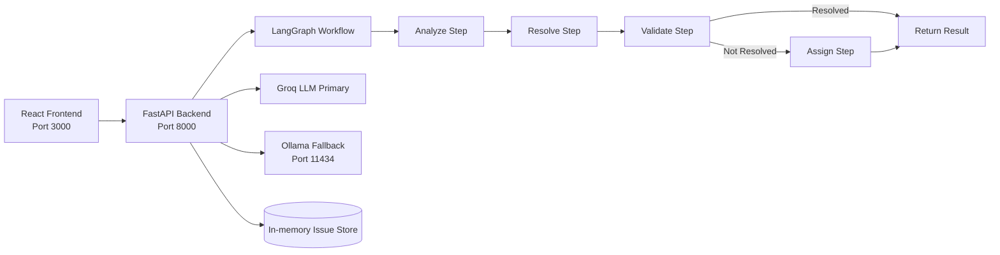

# Ticket Resolution AI Platform

Enterprise-grade agentic AI system for end-to-end ticket handling:
- Analyze technical incidents
- Propose remediation steps
- Validate solution confidence
- Auto-assign unresolved issues

This repository contains a FastAPI backend, a React frontend, and Docker orchestration with Ollama fallback support.

---

## Table of Contents
- [What This Project Does](#what-this-project-does)
- [Architecture](#architecture)
- [Tech Stack](#tech-stack)
- [Repository Structure](#repository-structure)
- [Quick Start (Recommended: Docker)](#quick-start-recommended-docker)
- [Quick Start (Local Development)](#quick-start-local-development)
- [Environment Configuration](#environment-configuration)
- [API Reference](#api-reference)
- [Example API Calls](#example-api-calls)
- [Operational Commands](#operational-commands)
- [Troubleshooting](#troubleshooting)
- [Production Notes](#production-notes)
- [Roadmap](#roadmap)
- [Contributing](#contributing)
- [License](#license)

---

## What This Project Does
When a ticket is submitted, the backend executes a workflow:
1. Analyze issue description and infer likely root cause.
2. Generate remediation steps.
3. Validate if the proposed fix is likely sufficient.
4. If unresolved, assign the ticket to a developer.

The frontend provides:
- Health and readiness dashboard
- Ticket submission UI
- Rich result view (root cause, confidence, remediation, assignment, execution metrics)

---

## Architecture



Workflow implementation details:
- Workflow factory: `backend/src/workflows/issue_workflow.py`
- Default workflow: `backend/src/workflows/sequential_issue_workflow.py`
- API entrypoint: `backend/src/api/main.py`

---

## Tech Stack

### Backend
- FastAPI
- LangGraph
- LangChain
- CrewAI
- Pydantic / pydantic-settings
- Optional LangSmith tracing
- ChromaDB dependencies present for RAG extension

### Frontend
- React 18
- react-scripts

### Runtime / Infra
- Docker / Docker Compose
- Ollama for local model fallback

---

## Repository Structure

```text
issue-resolution-agentic-platform/
├── backend/
│   ├── src/
│   │   ├── api/               # FastAPI routes
│   │   ├── agents/            # Agent definitions
│   │   ├── tasks/             # Agent tasks
│   │   ├── workflows/         # LangGraph workflows
│   │   ├── schemas/           # Request/response models
│   │   └── config/            # Settings, logging, tracing
│   ├── data/                  # Sample KB/log/metric datasets
│   ├── logs/
│   ├── requirements.txt
│   └── Dockerfile
├── frontend/
│   ├── src/
│   │   ├── components/
│   │   ├── App.jsx
│   │   └── ...
│   ├── package.json
│   └── Dockerfile
├── docker-compose.yml
├── docker-compose.prod.yml
├── Makefile
└── README.md
```

---

## Quick Start (Recommended: Docker)

### Prerequisites
- Docker Desktop (or Docker Engine + Compose)
- Ports available: `3000`, `8000`, `11434`

### 1) Start services
```bash
docker compose up -d --build
```

### 2) Verify health
```bash
curl http://localhost:8000/health
```

Expected response includes:
- `status: healthy`
- `workflow_ready: true`

### 3) Open the app
- Frontend: `http://localhost:3000`
- Backend API docs: `http://localhost:8000/docs`

### 4) Optional: pull an Ollama model
```bash
docker exec ticket-resolution-ollama ollama pull llama2
```

### 5) Stop services
```bash
docker compose down
```

---

## Quick Start (Local Development)

Use this if you prefer running backend/frontend directly without Docker.

### Prerequisites
- Python 3.11 (recommended for dependency compatibility)
- Node.js 18+

### Backend
```bash
cd backend
python -m venv .venv
source .venv/bin/activate   # Windows: .venv\Scripts\activate
pip install -r requirements.txt
python -m uvicorn src.api.main:app --reload --host 0.0.0.0 --port 8000
```

### Frontend
```bash
cd frontend
npm install
npm start
```

Frontend defaults to backend URL `http://localhost:8000`.

---

## Environment Configuration

Backend settings are loaded from environment variables and optional `.env` in `backend/`.

### Core variables
| Variable | Default | Description |
|---|---|---|
| `API_HOST` | `0.0.0.0` | Backend bind host |
| `API_PORT` | `8000` | Backend bind port |
| `LLM_PROVIDER` | `groq` | Preferred provider |
| `GROQ_API_KEY` | empty | Groq API key |
| `GROQ_MODEL` | `llama-3.1-70b-versatile` | Groq model |
| `OLLAMA_ENABLED` | `true` | Enable Ollama fallback |
| `OLLAMA_BASE_URL` | `http://localhost:11434` (local) / `http://ollama:11434` (compose) | Ollama endpoint |
| `OLLAMA_MODEL` | `llama2` | Ollama model name |
| `USE_OLLAMA_FALLBACK` | `true` | Fallback if Groq fails |
| `LOG_LEVEL` | `INFO` | Logging verbosity |
| `LANGSMITH_ENABLED` | `false` | Enable tracing |
| `LANGSMITH_API_KEY` | empty | LangSmith API key |

---

## API Reference

### Health
- `GET /health`
- Returns service status and workflow readiness.

### Create and process issue
- `POST /issues`
- Request body:
```json
{
  "description": "Database connection timeout during peak traffic",
  "severity": "high",
  "issue_id": "optional-custom-id"
}
```

### Get issue by id
- `GET /issues/{issue_id}`

### Main response fields
- `issue_id`
- `description`
- `severity`
- `root_cause`
- `analysis_confidence`
- `remediation_steps`
- `is_resolved`
- `assigned_to`
- `messages`
- `execution_metrics`
- `created_at`, `updated_at`
- `error`

---

## Example API Calls

### Create issue
```bash
curl -X POST http://localhost:8000/issues \
  -H "Content-Type: application/json" \
  -d '{
    "description": "Users get 502 errors while submitting checkout requests.",
    "severity": "critical"
  }'
```

### Fetch issue
```bash
curl http://localhost:8000/issues/<issue_id>
```

---

## Operational Commands

### Docker Compose
```bash
docker compose up -d --build
docker compose ps
docker compose logs -f backend
docker compose logs -f frontend
docker compose logs -f ollama
docker compose down
```

### Makefile shortcuts
```bash
make up
make ps
make logs-backend
make health
make down
```

---

## Troubleshooting

### 1) Port already in use (3000/8000/11434)
Symptom:
- Container start fails with bind errors.

Fix:
- Stop conflicting services on those ports.
- Re-run `docker compose up -d`.

### 2) Ollama container unhealthy
Symptom:
- Backend waits on Ollama health.

Fix:
- Check logs: `docker logs ticket-resolution-ollama`
- Verify Ollama responds: `curl http://localhost:11434/api/tags`

### 3) Backend starts but workflow not ready
Symptom:
- `/health` shows `workflow_ready: false`

Fix:
- Confirm LLM configuration (`GROQ_API_KEY` or Ollama fallback enabled).
- Check backend logs for model initialization errors.

### 4) Frontend cannot call backend
Symptom:
- Health card shows error.

Fix:
- Ensure backend is reachable at `http://localhost:8000`.
- If using custom backend URL, set `REACT_APP_API_URL` accordingly.

---

## Production Notes
- Use `docker-compose.prod.yml` for production-oriented runs.
- Replace placeholder secrets with managed secret storage.
- Add persistent database for issue state (current store is in-memory).
- Add authn/authz and rate limiting before internet exposure.
- Use centralized logging and monitoring dashboards.

---

## Roadmap
- Integrate real Jira/Splunk/Dynatrace connectors
- Persist issues in PostgreSQL
- Add confidence thresholds for auto-resolution policies
- Add role-based access and audit trails
- Expand automated test coverage

---

## Contributing
1. Fork and clone
2. Create feature branch
3. Run formatting/lint/tests
4. Open pull request with clear scope and testing notes

---

## License
MIT
